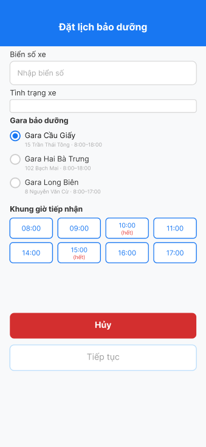

# ĐÁNH GIÁ CHẤT LƯỢNG KỸ NĂNG PHÂN TÍCH VÀ THIẾT KẾ HỆ THỐNG

**ĐỀ SỐ 02 · THỜI GIAN: 90 phút**

## Yêu cầu chung

- Duplicate file Figma mẫu trước khi làm bài (tự dựng Frame 1 theo mô tả ở mục A4 nếu chưa có file mẫu).
- Đặt tên file Figma và Word: `[Mã Lớp]_[Họ Tên]_[Mã Đề]`. Ví dụ: `HN_KS25_CNTT1_TranMinhCuong_02`.
- Công cụ: Figma, Microsoft Word, Draw.io.
- Nộp: (1) 01 file Word chứa phần Phân tích yêu cầu, Activity Diagram, Thiết kế ERD, Phân tích tác động và bảng lỗi UI/UX; (2) link Figma đã mở quyền xem, gồm Frame 1 đã chỉnh sửa và Frame trạng thái của luồng thay thế A1.

---

## PHẦN A. TÀI LIỆU

### A1. Bối cảnh và quy tắc nghiệp vụ

Chuỗi gara xe máy cần bổ sung chức năng "Đặt lịch bảo dưỡng" trên ứng dụng di động. Khách hàng chọn xe của mình, ghi tình trạng xe, chọn gara và khung giờ mang xe đến, có thể đăng ký thêm dịch vụ (rửa xe, thay nhớt, vệ sinh kim phun) và nhận mã phiếu bảo dưỡng. Hệ thống phải phản hồi nhanh khi nhiều khách đặt lịch cùng lúc và bắt buộc bảo mật thông tin cá nhân, giấy đăng ký xe của khách.

Quy tắc nghiệp vụ (BR – Business Rule):

- **BR1:** Chỉ xe đã đến hạn bảo dưỡng (tối thiểu 90 ngày kể từ lần bảo dưỡng gần nhất) mới được đặt lịch.
- **BR2:** Mỗi gara có nhiều khung giờ tiếp nhận; mỗi khung giờ thuộc một gara và nhận tối đa một số xe nhất định.
- **BR3:** Một phiếu bảo dưỡng thuộc một khách hàng và một khung giờ, ghi nhận một xe theo biển số. Khách hàng có thể có nhiều phiếu, nhưng một biển số không được có hai phiếu đang xử lý cùng lúc.
- **BR4:** Một phiếu bảo dưỡng có thể đăng ký không hoặc nhiều dịch vụ thêm; một dịch vụ có trong nhiều phiếu.
- **BR5:** Phí dịch vụ thêm tính theo giá tại thời điểm đặt lịch, không theo bảng giá hiện hành.

### A2. Đặc tả Use Case "Đặt lịch bảo dưỡng"

| | |
|---|---|
| **Actor** | Khách hàng đã đăng nhập. |
| **Main flow** | 1. Chọn xe cần bảo dưỡng từ danh sách xe đã đăng ký, nhập ghi chú tình trạng xe.<br>2. Hệ thống hiển thị các gara và khung giờ tiếp nhận.<br>3. Chọn một gara, một khung giờ, bấm "Tiếp tục".<br>4. Chọn dịch vụ thêm (không bắt buộc), nhập ghi chú cho thợ.<br>5. Xem phí dự kiến, bấm "Đặt lịch".<br>6. Hệ thống kiểm tra xe đã đến hạn bảo dưỡng và khung giờ còn chỗ, tạo phiếu bảo dưỡng, cấp mã phiếu, hẹn ngày lấy xe, hiển thị thành công. |
| **Alternative flow** | **A1 (bước 3):** Chưa chọn khung giờ → nút "Tiếp tục" bị vô hiệu hoá, hiển thị cảnh báo.<br>**A2 (bước 6):** Khung giờ vừa hết chỗ → thông báo, quay lại bước 3. |

### A3. Dữ liệu sơ bộ

Danh sách chưa có khoá ngoại, quan hệ và bản số.

| Thực thể | Thuộc tính |
|---|---|
| **Customer** | id, full_name, phone_number, email |
| **Garage** | id, garage_name, address, hotline |
| **MaintenanceSlot** | id, slot_date, start_time, end_time |
| **MaintenanceTicket** | id, ticket_code, license_plate, vehicle_model, last_service_date, days_since_last_service, vehicle_note, status |
| **AddOnService** | id, service_name, current_price |

**Thông tin cần lưu nhưng chưa được gán vào thực thể nào:** `max_vehicles` (số xe tối đa của khung giờ), `estimated_pickup_date` (ngày hẹn lấy xe), `service_fee` (phí dịch vụ thêm lúc đặt lịch).

### A4. Frame 1 – Chọn xe và khung giờ tiếp nhận

Màn hình **"Đặt lịch bảo dưỡng"** (header xanh), từ trên xuống:


```
[ Biển số xe ]            ô nhập cao 44px, gợi ý "Nhập biển số"
[ Tình trạng xe ]         ô nhập cao 24px, gợi ý trống
Gara bảo dưỡng            (radio, TT đầu tiên đã chọn sẵn)
  ◉ Gara Cầu Giấy         15 Trần Thái Tông · 8:00–18:00   (chữ xám nhạt, cỡ 10px)
  ○ Gara Hai Bà Trưng     102 Bạch Mai · 8:00–18:00
  ○ Gara Long Biên        8 Nguyễn Văn Cừ · 8:00–17:00
Khung giờ tiếp nhận       (8 nút cùng viền xanh, cùng nền)
  08:00   09:00   10:00 (hết)   11:00
  14:00   15:00 (hết)   16:00   17:00
[ Hủy ]                   nút đỏ đậm, rộng
[ Tiếp tục ]              nút viền xanh nhạt, chữ xám, luôn sáng dù chưa chọn khung giờ
```

*(Trong đề thật đây là một hình Figma; ở đây mô tả bằng chữ để bạn tự dựng lại và tìm lỗi.)*

---

## PHẦN B. YÊU CẦU

### Phân tích yêu cầu

- Xác định Actor chính và vai trò.
- Liệt kê 4 yêu cầu chức năng và 2 yêu cầu phi chức năng.
- Chọn 2 BR, chỉ ra bước Use Case chịu tác động.
- Chỉ ra 1 điểm chưa rõ trong tài liệu và đặt câu hỏi làm rõ.

### Activity Diagram

- Viết lại bước 6 của Main flow thành các bước con (6.1, 6.2, …), mỗi bước chỉ thể hiện một hành động của hệ thống.
- Vẽ Activity Diagram cho bước 5 → bước 6 theo đặc tả đã viết lại, chia 2 làn: Khách hàng và Hệ thống.
- Thể hiện đúng thứ tự hành động, điểm bắt đầu/kết thúc và nhánh rẽ (decision) cho luồng A2.

### Thiết kế ERD

- Vẽ ERD từ Mục A3: bảng, PK, FK, bản số; tự quyết định bảng cần thêm.
- Đặt 3 thuộc tính chưa gán vào đúng bảng.
- Chỉ ra 1 thuộc tính không nên lưu trong Mục A3, giải thích ngắn.

### UI/UX trên Figma

- Lập bảng tối đa 4 lỗi của Frame 1: Lỗi | Nguyên tắc vi phạm | Cách sửa.
- Sửa Frame 1 theo bảng lỗi; nêu CTA chính (Call To Action – nút hành động chính của màn hình) và lý do.
- Tạo Frame trạng thái cho luồng thay thế A1 (chưa chọn khung giờ).

### Phân tích tác động

**Yêu cầu:** "Một phiếu bảo dưỡng được đặt cho nhiều xe của cùng một khách hàng mang đến trong cùng một lần."

- Nêu ngắn tác động đến: giao diện, validation, Use Case/Activity, ERD. Không cần vẽ lại.

---

## PHẦN C. THANG ĐIỂM CHI TIẾT

| STT | Nghiệp vụ cần đạt được | Mô tả chi tiết nghiệp vụ | Điểm |
|---|---|---|---|
| 1 | Phân tích yêu cầu | • Actor và vai trò: 3<br>• Yêu cầu chức năng: tối đa 4<br>• Yêu cầu phi chức năng: tối đa 3<br>• Mapping 2 BR: tối đa 5<br>• Điểm chưa rõ + câu hỏi làm rõ: 5 | 20 |
| 2 | Activity Diagram | • Viết lại bước 6 thành các bước con hợp lý: 3<br>• Đúng ký hiệu (bắt đầu, hành động, kết thúc): 2<br>• Đúng thứ tự hành động: 4<br>• Chia đúng làn Khách hàng / Hệ thống: 2<br>• Tạo phiếu, cấp mã phiếu, hẹn ngày lấy xe nằm ở làn Hệ thống: 2<br>• Decision cho A2 (hết chỗ → quay lại bước 3): 2 | 15 |
| 3 | Thiết kế ERD | • Bảng + PK: 5<br>• FK và bản số cho quan hệ 1-n: 7<br>• MaintenanceTicket–AddOnService → bảng trung gian, đúng service_fee: 6<br>• Đặt đúng max_vehicles, estimated_pickup_date: 3<br>• Thuộc tính không nên lưu + giải thích: 4 | 25 |
| 4 | Frame 1 & UI/UX | • Phân tích tối đa 4 lỗi (3 điểm/lỗi): 12<br>• Chỉnh sửa Figma tương ứng (2 điểm/lỗi): 8<br>• CTA chính + giải thích: 2<br>• Frame luồng thay thế A1: 3 | 25 |
| 5 | Phân tích tác động | • Giao diện: 2<br>• Validation: 2<br>• Use Case/Activity: 2<br>• ERD: 4 | 10 |
| 6 | Trình bày & hình thức | • Nộp đầy đủ, đúng định dạng: 2<br>• Đúng tên file: 1<br>• Trình bày rõ ràng: 2 | 5 |
| | **Tổng cộng** | | **100** |
